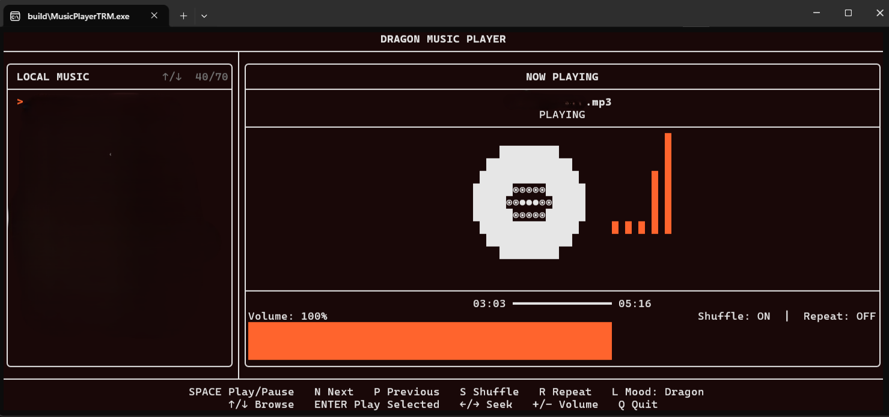
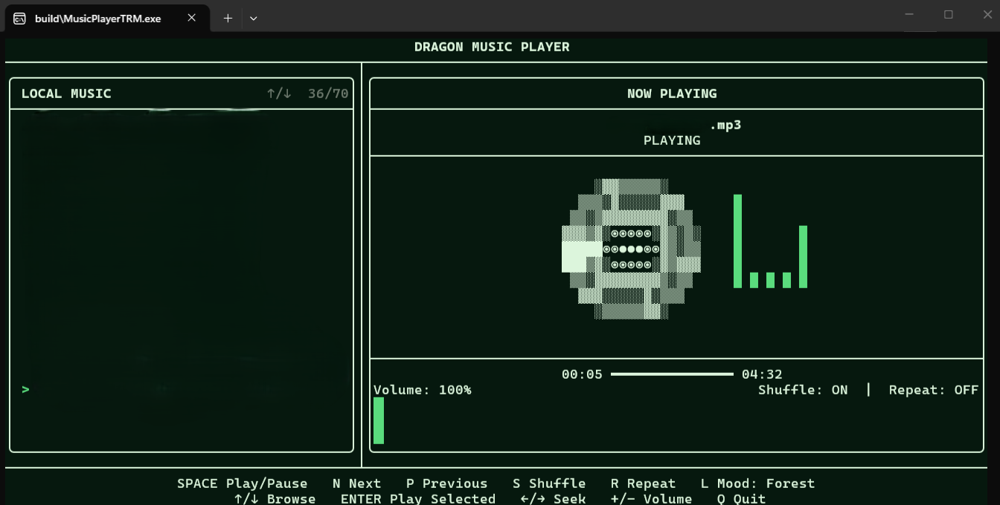

# 🐉 DRAGON Music Player

A lightweight, keyboard-first terminal music player for Windows.

DRAGON is built with **C++20**, **FTXUI**, and **miniaudio** and is designed for playing local music files directly from the terminal.

No streaming services.  
No accounts.  
No unnecessary background services.

---

## 📸 Screenshots

### DRAGON Music Player



### DRAGON Music Player



---

## ✨ Features

- 🎵 Local music playback
- 📁 Recursive music folder scanning
- ▶️ Play / Pause
- ⏭️ Next song
- ⏮️ Previous song
- 💿 Animated terminal vinyl
- 📊 Animated audio visualizer
- 🎨 Multiple interface moods
- 💾 Remembers your music folder
- ⚡ Lightweight terminal application
- 📴 Local music playback

---

# 🎧 Supported Audio Formats

DRAGON currently supports:

```text
.mp3
.wav
.flac
.ogg
.m4a
```

---

# 🖥️ Environment

```text
Operating System : Windows 10 / Windows 11
Language         : C++20
Compiler         : GCC / MinGW
Build System     : CMake
Terminal UI      : FTXUI
Audio Engine     : miniaudio
```

---

# ⚙️ Setup DRAGON on Windows

Follow the steps below to set up DRAGON on a Windows device.

All commands in this guide are intended to be run in **PowerShell**.

---

## 1. Install Git

Git is required to download the DRAGON source code from GitHub.

Install Git using PowerShell:

```
winget install --id Git.Git -e
```

After installation, close PowerShell and open it again.

Check that Git is installed:

```
git --version
```

You can also check its location:

```
where.exe git
```

---

# 2. Install GCC / MinGW

DRAGON requires a **C++20-compatible GCC compiler**.

Install WinLibs MinGW using:

```
winget install BrechtSanders.WinLibs.POSIX.UCRT
```

After installation, close PowerShell and open it again.

Check the GCC version:

```
gcc --version
```

Check the G++ version:

```
g++ --version
```

Check that GCC is available in PATH:

```
where.exe gcc
```

Check G++:

```
where.exe g++
```

---

# 3. Install CMake

CMake is used to configure and build DRAGON.

Install CMake:

```
winget install --id Kitware.CMake -e
```

After installation, close PowerShell and open it again.

Check the CMake version:

```
cmake --version
```

Check that CMake is available in PATH:

```
where.exe cmake
```

---

# 4. Verify the Development Environment

Run:

```
git --version
gcc --version
g++ --version
cmake --version
```


If all commands return valid versions and paths, the development environment is ready.

---

# 5. Download the DRAGON Source Code

Clone the repository using Git:

```
git clone https://github.com/sumit12c/Terminal_Music_Player.git
```

> Replace `YOUR_USERNAME` with the GitHub username that owns this repository.

Enter the project directory:

```
cd MUSIC_PLAYER_trm
```

---

# 6. Download miniaudio

DRAGON uses **miniaudio** for local audio playback.

The project requires:

```
miniaudio.c
miniaudio.h
```

Create the `third_party` directory:

```
New-Item -ItemType Directory -Force .\third_party
```

Download `miniaudio.h`:

```
curl.exe -L "https://raw.githubusercontent.com/mackron/miniaudio/master/miniaudio.h" -o ".\third_party\miniaudio.h"
```

Download `miniaudio.c`:

```
curl.exe -L "https://raw.githubusercontent.com/mackron/miniaudio/master/miniaudio.c" -o ".\third_party\miniaudio.c"
```

Verify the files:

```
Get-ChildItem .\third_party
```

You should see:

```
miniaudio.c
miniaudio.h
```

---

# 7. FTXUI Setup

DRAGON uses **FTXUI** for its terminal user interface.

The project uses:

```
FTXUI v7.0.3
```

You do **not** need to manually download or install FTXUI.

CMake automatically downloads FTXUI when the project is configured.

---

# 📁 Project Structure

After cloning the repository and downloading miniaudio, the project should contain:

```
MUSIC_PLAYER_trm/
│
├── src/
│   └── main.cpp
│
├── third_party/
│   ├── miniaudio.c
│   └── miniaudio.h
│
├── SS1.png
├── SS2.png
├── CMakeLists.txt
├── README.md
└── .gitignore
```

The `build/` directory will be created automatically by CMake.

---

# 🔨 8. Configure the Project

From inside the DRAGON project directory:

```
cmake -S . -B build -G "MinGW Makefiles"
```

CMake will configure the project and automatically download the required FTXUI dependency.

---

# 🏗️ 9. Build DRAGON

Build the project using:

```
cmake --build build --clean-first
```

After a successful build, the executable will be located at:

```
build\MusicPlayerTRM.exe
```

---

# ▶️ 10. Run DRAGON

Run DRAGON from PowerShell:

```
.\build\MusicPlayerTRM.exe
```

On the first launch, DRAGON asks for your music folder.

Example:

```
Enter your music folder:

> C:\Users\YourName\Music
```

Enter the path to the folder containing your music.

DRAGON will recursively scan the folder and its subfolders for supported audio files.

---

# 💾 Music Folder

DRAGON remembers the music folder you selected.

The folder path is stored locally in:

```
config.txt
```

On future launches, DRAGON automatically uses the saved music folder.

You do not need to enter the folder again.

If you want to select a different music folder, delete `config.txt`:

```
Remove-Item .\config.txt
```

Then start DRAGON again:

```
.\build\MusicPlayerTRM.exe
```

---

# 🛠️ Rebuilding After Code Changes

If you modify `src/main.cpp` or another project file, rebuild using:

```
cmake --build build --clean-first
```

Then run:

```
.\build\MusicPlayerTRM.exe
```

---

# 🧹 Completely Clean the Build

To remove the generated CMake build directory:

```
Remove-Item -Recurse -Force .\build
```

Configure the project again:

```
cmake -S . -B build -G "MinGW Makefiles"
```

Then build:

```
cmake --build build --clean-first
```

Run:

```
.\build\MusicPlayerTRM.exe
```

---

# 🐉 Add the `dragon` Command

To launch DRAGON without typing the full executable path, add the project folder
to your Windows User PATH.

Run these commands from the DRAGON project directory:

```powershell
$dragonPath = (Get-Location).Path

[Environment]::SetEnvironmentVariable(
	"Path",
	[Environment]::GetEnvironmentVariable("Path", "User") + ";" + $dragonPath,
	"User"
)

where.exe dragon
```

Close PowerShell and open a new PowerShell window so the updated User PATH is
loaded. Then launch DRAGON from any directory with:

```powershell
dragon
```

The `dragon` command runs the [`dragon.cmd`](dragon.cmd) launcher.

---

# ⚡ Lightweight Design

DRAGON is designed to remain lightweight.

The application focuses on:

- Local audio playback
- Terminal rendering
- Minimal background processing
- No streaming services
- No web interface
- No account system
- No advertisements

Actual CPU and RAM usage depends on the computer, terminal, audio file, and operating system.

---

# 🔒 Local Music

DRAGON is intended for music stored on your own computer.

It does not provide music streaming.

Your music files remain in their original location.

DRAGON only scans the music folder you provide and plays supported audio files.

---

# 🐉 DRAGON

```
Your music.
Your terminal.
No unnecessary complexity.
```
